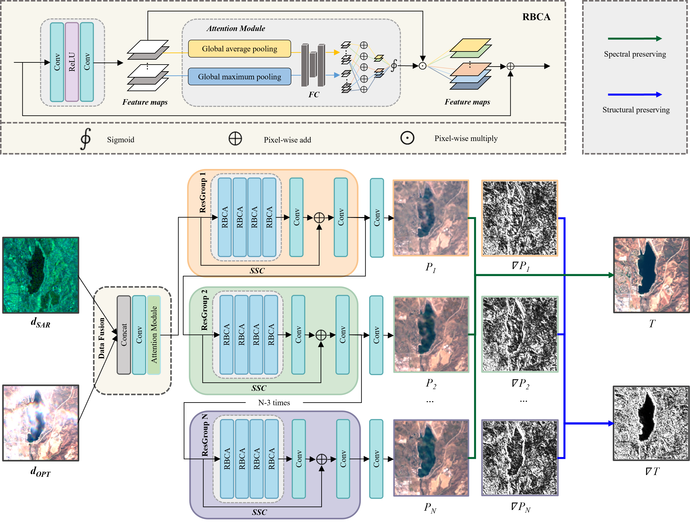

<div align="center">
<h1>HS2P: Hierarchical spectral and structure-preserving fusion network for
multimodal remote sensing image cloud and shadow removal</h1>
</div>

<div align="center">
    
</div>
<div align="center">
  
</div>


## 1. INTRODUCTION

This is the source code of [***HS2P: Hierarchical spectral and structure-preserving fusion network for multimodal remote sensing image cloud and shadow removal***]. In this work, we proposed a novel hierarchical spectral and structure-preserving fusion network called ***HS2P*** for cloud and shadow removal in optical remote sensing imagery.

The architecture of *HS2P* is shown as follows.

<div align="center"></div>


## 2. DATASET

We ues the public large-scale dataset named SEN12MS-CR, which contains triplets of cloudy Sentinel-2 optical images, cloud-free Sentinel-2 optical images and Sentinel-1 SAR images.

You can get more details about this dataset at [here](https://mediatum.ub.tum.de/1554803) and directly download the source SEN12MSCR dataset at [download](https://mediatum.ub.tum.de/1554803).

Then divide all the patches into three subdatasets, namely, training set, validation set, testing, and write the division in a *.csv* file as:

**label s1 s2 s2_cloudy patch_s2_name**

**label s1 s2 s2_cloudy patch_s2_name**

**...**

Here *label* is a number and 1 represents training set, 2 represents validation set and 3 represents testing set. *patch_s2_name* are the names of cloud-free Sentinel-2 optical images.

Then build the file structure in your computer as the folder `dataset` shown. 

```
./
+-- Dataset
    +--	s1
        +-- train
        |   +-- 0.tif
        |   +-- ...
        +-- val
        |   +-- 0.tif
        |   +-- ...
        +-- test
        |   +-- 0.tif
        |   +-- ...
     +-- s2
        +-- train
        |   +-- 0.tif
        |   +-- ...
        +-- val
        |   +-- 0.tif
        |   +-- ...
        +-- test
        |   +-- 0.tif
        |   +-- ...
     +-- s2_cloudy
        +-- train
        |   +-- 0.tif
        |   +-- ...
        +-- val
        |   +-- 0.tif
        |   +-- ...
        +-- test
        |   +-- 0.tif
        |   +-- ...
```

The distributions of our training set, validation set and testing set are shown below.

<div align="center"></div>


## 3. TRAIN
Set model parameters in config.ini and the config.ini file path in main.py first before the training phase.

Run:

```bash
python main.py
```


## 4. TEST
Set model parameters in config.ini and the config.ini file path in main.py first before the testing phase.

The predict_file parameter must be supplied.

Run:

```bash
python main.py
```

Some results are shown as bellow and Row1-4 of the image are: SAR images, cloudy images, ground truth, the predicted results of HS2P.

<div align="center"></div>


## 5. CONTACT

If you have any questions about this work please concat me.

E-mail: wfy199905@163.com


## 6. CREDICTS
This code referenced the code by [Andrea Meraner](https://github.com/ameraner/dsen2-cr) and was modified based on it.

I am grateful to the authors for making their source code publicly available.


